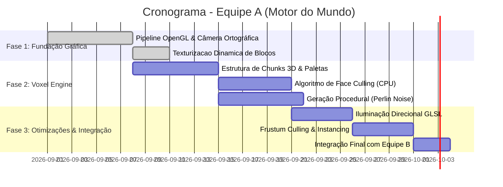
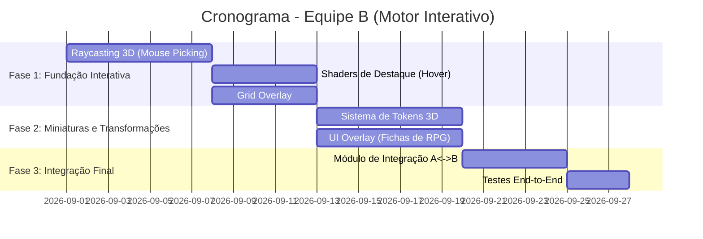

# 🎲 Isometricon

<div align="center">

[](LICENSE)
[](https://github.com/Ak4ai/Isometricon/wiki)
[](https://www.opengl.org/)
[](docs/SHADERS.md)
[](docs/ARCHITECTURE.md)
[](https://www.cefetmg.br/)

**Um motor gráfico 3D isométrico baseado em blocos (Voxel-based Virtual Tabletop Engine) para mesas de RPG tático.**

[📖 GitHub Wiki](https://github.com/Ak4ai/Isometricon/wiki) • [🏛️ Arquitetura A](docs/ARCHITECTURE.md) • [🟦 Arquitetura B](docs/EQUIPE_B_ARCHITECTURE.md) • [🎨 Shaders](docs/SHADERS.md) • [🔗 Integração](docs/INTEGRATION_SPEC.md) • [📋 Proposta](proposta.md)

</div>

---

## 📖 Visão Geral

O **Isometricon** é uma fundação de **Virtual Tabletop (VTT)** tridimensional com estética voxel (estilo *Minecraft*) renderizada sob uma **perspectiva isométrica ortográfica**.

O projeto foi concebido para atuar como um **auxílio visual gráfico de alto desempenho** para mestres e jogadores de RPG de mesa: o software cuida da renderização de terreno 3D, iluminação direcional, culling e renderização instanciada em OpenGL raiz, enquanto os jogadores aplicam regras e rolam seus dados na mesa física.

> 🎯 **Projeto dividido em dois subprojetos complementares no mesmo repositório:**
>
> - 🟩 **Equipe A — Motor do Mundo:** Pipeline gráfico de baixo nível, geração procedural de terreno (Perlin Noise), Chunks 3D, Face Culling (CPU) e Instanced Rendering (GPU).
> - 🟦 **Equipe B — Motor Interativo:** Raycasting 3D (Mouse Picking), grid overlay, miniaturas de personagens com matrizes de transformação e UI de fichas de RPG.

---

## 👥 Equipes e Divisão de Responsabilidades

| | 🟩 Equipe A — Motor do Mundo | 🟦 Equipe B — Motor Interativo |
|:---:|:---|:---|
| **Foco** | Geração, Otimização e Renderização do Terreno | Interação, Seleção e Interface de VTT |
| **Pasta principal** | `src/world/`, `src/rendering/`, `src/camera/` | `src/interaction/`, `src/integration/` |
| **Shaders** | `world.vert`, `world.frag`, `world_textured.*` | `highlight.vert/.frag`, `grid.vert/.frag`, `ui.vert/.frag` |
| **Milestones** | [Fases 1–4 Motor A](https://github.com/Ak4ai/Isometricon/milestones) | [Fases 1–3 Motor B](https://github.com/Ak4ai/Isometricon/milestones) |
| **Issues** | #5, #6, #7, #8, #9 | #27, #28, #29, #30, #31, #33 |
| **Documentação** | [ARCHITECTURE.md](docs/ARCHITECTURE.md) | [EQUIPE_B_ARCHITECTURE.md](docs/EQUIPE_B_ARCHITECTURE.md) |

---

## 🏛️ Arquitetura & Divisão Modular

```
Isometricon/
├── .github/
│   ├── workflows/             # CI / Automação de testes e linter
│   ├── ISSUE_TEMPLATE/        # Templates para tarefas de CG, bugs e features
│   └── PULL_REQUEST_TEMPLATE.md
├── assets/
│   ├── shaders/               # Shaders GLSL 330 core
│   │   ├── world.vert/frag          # 🟩 Shader de terreno
│   │   ├── world_textured.vert/frag # 🟩 Shader de terreno texturizado
│   │   ├── highlight.vert/frag      # 🟦 Shader de destaque/hover
│   │   ├── grid.vert/frag           # 🟦 Shader de grid overlay
│   │   └── ui.vert/frag             # 🟦 Shader 2D de UI
│   ├── textures/blocks/       # 🟩 1110 texturas PNG 16×16 de blocos
│   └── schematics/            # Schematics de referência
├── docs/
│   ├── ARCHITECTURE.md            # 🟩 Arquitetura do Motor do Mundo
│   ├── EQUIPE_B_ARCHITECTURE.md   # 🟦 Arquitetura do Motor Interativo
│   ├── INTEGRATION_SPEC.md        # 🔗 Contrato de integração A ↔ B
│   └── SHADERS.md                 # 🎨 Guia de iluminação e pipeline GLSL
├── src/
│   ├── camera/                # 🟩 Câmera Isométrica (Matrizes View & Ortho)
│   ├── math/                  # 🟩 Álgebra Linear (Vector3, Matrix4)
│   ├── rendering/             # 🟩 Mesh, TexturedMesh, Shaders, VAO/VBO/EBO
│   ├── world/                 # 🟩 Chunks 3D, VoxelGrid, Face Culling, Noise
│   ├── interaction/           # 🟦 Raycasting, Grid, Tokens, UI (Equipe B)
│   └── integration/           # 🔗 Bridge Equipe A ↔ Equipe B
├── tests/
│   ├── test_camera.py         # 🟩 Testes da câmera
│   ├── test_math.py           # 🟩 Testes de álgebra linear
│   ├── test_rendering.py      # 🟩 Testes de renderização
│   ├── test_version.py        # 🟩 Testes de versão
│   └── test_interaction.py    # 🟦 Testes do motor interativo (Equipe B)
├── proposta.md                # Proposta acadêmica original
├── CONTRIBUTING.md            # Guia de contribuição
├── LICENSE
└── README.md
```

---

## 🔬 Fundamentos de Computação Gráfica

### 🟩 Motor do Mundo (Equipe A)

#### 1. 📐 Câmera Isométrica com Projeção Ortográfica
* **Ângulo de Rotação (Yaw):** $45°$ em torno do eixo Y.
* **Ângulo de Inclinação (Pitch):** $\arcsin(\tan(30°)) \approx 35.264°$ em torno do eixo X.
* **Matriz de Projeção Ortográfica:**

$$\mathbf{P}_{\text{ortho}} = \begin{bmatrix} \frac{2}{r - l} & 0 & 0 & -\frac{r + l}{r - l} \\ 0 & \frac{2}{t - b} & 0 & -\frac{t + b}{t - b} \\ 0 & 0 & \frac{-2}{f - n} & -\frac{f + n}{f - n} \\ 0 & 0 & 0 & 1 \end{bmatrix}$$

#### 2. ⚡ Face Culling na CPU
Para cada bloco em $(x, y, z)$, seus 6 vizinhos são inspecionados. Faces adjacentes a blocos sólidos são descartadas, reduzindo > 75% dos vértices enviados à GPU.

#### 3. 🎨 Shaders GLSL (Pipeline Programável)
* **Vertex Shader:** Aplica $\mathbf{MVP} = \mathbf{P}_{\text{ortho}} \times \mathbf{V} \times \mathbf{M}$ e repassa normais.
* **Fragment Shader:** Iluminação Lambertiana — $I = I_a \cdot k_a + I_d \cdot k_d \cdot \max(\vec{N} \cdot \vec{L}, 0)$.

### 🟦 Motor Interativo (Equipe B)

#### 4. 🎯 Raycasting 3D (Mouse Picking)
Converte o clique 2D do mouse em um raio 3D no espaço do mundo:

$$\vec{d} = \text{normalize}\left(\mathbf{V}^{-1} \times \mathbf{P}^{-1} \times (x_{\text{ndc}}, y_{\text{ndc}}, 1, 0)\right)$$

Testa interseção do raio com as AABBs dos blocos (Slab Method) para determinar o bloco clicado.

#### 5. 🖼️ Shaders de Destaque
Fragment Shader com efeito pulsante via `sin(u_Time)` e blending aditivo para hover e seleção.

#### 6. 🗂️ Matrizes de Transformação de Tokens
Cada miniatura tem sua própria matriz de modelo: $\mathbf{M} = \mathbf{T} \times \mathbf{R} \times \mathbf{S}$ com interpolação linear entre posições da grade.

---

## 🤝 Integração: Equipe A ↔ Equipe B

O **Isometricon** foi planejado com interfaces limpas no módulo `src/integration/` para desacoplar os dois subprojetos:

| Módulo | Equipe A (Motor do Mundo) | Equipe B (Motor Interativo) |
| :--- | :--- | :--- |
| **Responsabilidade** | Chunks, VoxelGrid, Terreno, Shaders, Otimização | Raycasting, Grid, Miniaturas, UI |
| **Fornece** | `VoxelGridProvider`, `CameraStateProvider` | Comandos de seleção e movimento |
| **Consome** | Coordenadas de foco e seleção da Equipe B | `VoxelGrid`, `ViewMatrix`, `ProjectionMatrix` |

> Consulte [docs/INTEGRATION_SPEC.md](docs/INTEGRATION_SPEC.md) para a especificação completa do contrato.

---

## 🚀 Roadmap & Cronograma (30 Dias)

### 🟩 Equipe A — Motor do Mundo



### 🟦 Equipe B — Motor Interativo



---

## 💻 Como Rodar o Projeto

### Pré-requisitos
* **Python 3.10+** (recomendado 3.12)
* **OpenGL 3.3 Core Profile** ou superior (GPU dedicada recomendada)
* **Git** e **VS Code** (opcional, mas recomendado)

### 🚀 Execução Rápida (3 Passos)

1. **Clone o repositório:**
   ```bash
   git clone https://github.com/Ak4ai/Isometricon.git
   cd Isometricon
   ```

2. **Instale as dependências:**
   ```bash
   pip install -r requirements.txt
   ```

3. **Inicie o motor gráfico:**
   ```bash
   python src/main.py
   ```
   *(Ou abra no VS Code e pressione **F5**!)*

> 💡 **GPU Dedicada:** O programa detecta e usa automaticamente sua GPU NVIDIA/AMD dedicada via driver hints (NVIDIA Optimus / AMD PowerXpress).

### 🕹️ Controles

| Ação | Controle |
|------|----------|
| Rotacionar bloco | `Q` / `E` |
| Zoom | Scroll do mouse |
| Pan (mover câmera) | `Espaço + Arrastar` ou `Botão do Meio` |
| Toggle grid | `G` *(Equipe B)* |
| Selecionar bloco | `Clique esquerdo` *(Equipe B)* |
| Mover miniatura | `Clique no destino` *(Equipe B)* |
| Sair | `ESC` |

### 🧪 Executando os Testes Unitários
```bash
pytest -v
```

---

## 📦 Compilação Local de Executáveis (.exe / Linux)

```bash
# Compilar para o seu sistema operacional atual:
python scripts/build.py

# Windows (.exe portátil):
python scripts/build.py --windows --onefile

# Linux (via WSL no Windows):
python scripts/build.py --linux

# Limpar arquivos temporários:
python scripts/build.py --clean
```

> 💡 **Atalho no VS Code**: Pressione **`Ctrl + Shift + B`** para o menu de compilação!

---

## 🏷️ Versionamento Automático & Releases

* **Arquivo de Versão Central ([`VERSION.txt`](VERSION.txt))**: Controla a versão semântica (ex: `0.1.0`).
* **Sincronização em Tempo Real**: Thread assíncrona compara commit local com `origin/main` e exibe status no console.
* **Esteira de Releases**: Ao alterar `VERSION.txt` na `main`, o GitHub Actions publica automaticamente:
  - 📦 `Isometricon-v<VER>-Windows-Portable.zip`
  - 💿 `Isometricon-v<VER>-Windows-Installer.exe`
  - 🐧 `Isometricon-v<VER>-Linux-Portable.tar.gz`

---

## 👥 Autores & Contribuições

* **🟩 Equipe A (Motor do Mundo):** Motor central de renderização, geração de terreno, câmera isométrica e otimizações de GPU.
* **🟦 Equipe B (Motor Interativo):** Raycasting 3D, seleção de blocos, miniaturas de personagens e interface de VTT.
* **Instituição:** CEFET-MG — Disciplina de Computação Gráfica.

---

## 📄 Licença

Este projeto está licenciado sob a licença [MIT](LICENSE).
