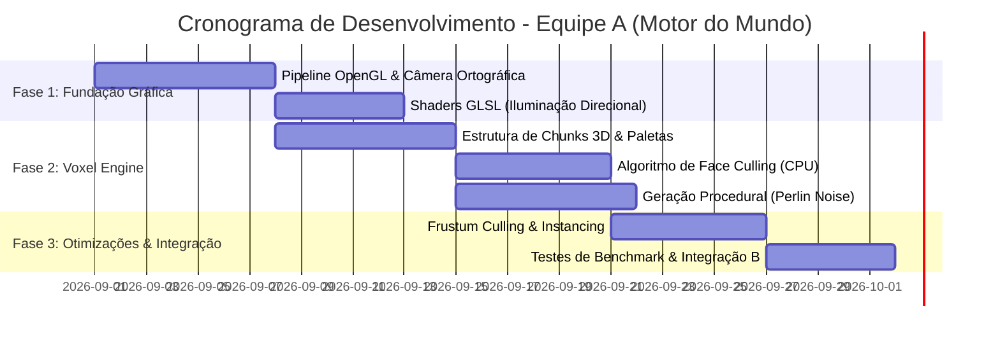

# 🎲 Isometricon

<div align="center">

[](LICENSE)
[](https://github.com/Ak4ai/Isometricon/wiki)
[](https://www.opengl.org/)
[](docs/SHADERS.md)
[](docs/ARCHITECTURE.md)
[](https://www.cefetmg.br/)

**Um motor gráfico 3D isométrico baseado em blocos (Voxel-based Virtual Tabletop Engine) para mesas de RPG tático.**

[📖 Acessar GitHub Wiki](https://github.com/Ak4ai/Isometricon/wiki) • [🏛️ Arquitetura](docs/ARCHITECTURE.md) • [🎨 Shaders](docs/SHADERS.md) • [🔗 Integração](docs/INTEGRATION_SPEC.md) • [📋 Proposta](proposta.md)

</div>

---

## 📖 Visão Geral

O **Isometricon** é uma fundação de **Virtual Tabletop (VTT)** tridimensional com estética voxel (estilo *Minecraft*) renderizada sob uma **perspectiva isométrica ortográfica**. 

O projeto foi concebido para atuar como um **auxílio visual gráfico de alto desempenho** para mestres e jogadores de RPG de mesa: o software cuida da renderização de terreno 3D, iluminação direcional, culling e renderização instanciada em OpenGL raiz, enquanto os jogadores aplicam regras e rolam seus dados na mesa física.

> 🎯 **Foco Atual — Equipe A (Motor do Mundo):**  
> Este repositório concentra o desenvolvimento do **Motor de Terreno e Mundo**, responsável pelo pipeline gráfico de baixo nível, geração procedural por ruído (Perlin/Simplex), particionamento de Chunks 3D, Face Culling (CPU) e Instanced Rendering (GPU). A camada interativa (Raycasting 3D, Grid e Miniaturas) é desacoplada e se integrará através de contratos de interface pré-estabelecidos.

---

## 🏛️ Arquitetura & Divisão Modular

O projeto adota uma arquitetura neutra e modular para permitir máxima performance gráfica e fácil interoperabilidade:

```
Isometricon/
├── .github/
│   ├── workflows/             # CI / Automação de testes e linter
│   ├── ISSUE_TEMPLATE/        # Templates para tarefas de CG, bugs e features
│   └── PULL_REQUEST_TEMPLATE.md
├── assets/
│   ├── shaders/               # Shaders GLSL 330 core (Vertex & Fragment)
│   │   ├── world.vert         # Vertex shader com projeção isométrica e normais
│   │   ├── world.frag         # Fragment shader com iluminação direcional
│   │   ├── highlight.vert     # Vertex shader de seleção/hover
│   │   └── highlight.frag     # Fragment shader de seleção/hover
│   └── textures/              # Texturas e paletas de blocos
├── docs/
│   ├── ARCHITECTURE.md        # Especificação detalhada de dados e algoritmos de CG
│   ├── INTEGRATION_SPEC.md    # Contrato de comunicação entre Equipe A e Equipe B
│   └── SHADERS.md             # Guia de iluminação e pipeline GLSL
├── src/
│   ├── camera/                # Câmera Isométrica (Matrizes View & Ortho Projection)
│   ├── math/                  # Estruturas vetoriais (Vector3, Matrix4, AABB)
│   ├── rendering/             # Meshing, VoxelRenderer, Shaders e Buffers (VAO/VBO/EBO)
│   ├── world/                 # Chunks 3D, VoxelGrid, Face Culling e Ruído Procedural
│   └── integration/           # Pontos de extensão e exportação de estado (Team B bridge)
├── proposta.md                # Proposta acadêmica original (Formato Dual 2x3)
├── CONTRIBUTING.md            # Guia de contribuição e convenções de código
├── LICENSE                    # Licença MIT
└── README.md
```

---

## 🔬 Fundamentos de Computação Gráfica

### 1. 📐 Câmera Isométrica com Projeção Ortográfica
Diferente da projeção perspectiva padrão, a projeção ortográfica preserva as proporções e o paralelismo geométrico, ideal para tabuleiros táticos:
* **Ângulo de Rotação (Yaw):** $45^\circ$ em torno do eixo Y.
* **Ângulo de Inclinação (Pitch):** $\arcsin(\tan(30^\circ)) \approx 35.264^\circ$ em torno do eixo X.
* **Matriz de Projeção:** Matriz ortográfica normalizada $(left, right, bottom, top, near, far)$.
* **Z-Buffer:** Gerenciamento nativo de profundidade via Depth Testing do OpenGL (`GL_DEPTH_TEST`).

$$\mathbf{P}_{\text{ortho}} = \begin{bmatrix} \frac{2}{r - l} & 0 & 0 & -\frac{r + l}{r - l} \\ 0 & \frac{2}{t - b} & 0 & -\frac{t + b}{t - b} \\ 0 & 0 & \frac{-2}{f - n} & -\frac{f + n}{f - n} \\ 0 & 0 & 0 & 1 \end{bmatrix}$$

### 2. ⚡ Face Culling na CPU (Otimização de Voxel Meshing)
Um terreno de $16 \times 16 \times 16$ blocos contém até 4.096 cubos (24.576 faces). O algoritmo de Face Culling inspeciona os 6 vizinhos $(\pm X, \pm Y, \pm Z)$ de cada bloco em tempo de geração de malha; faces adjacentes a blocos sólidos são descartadas imediatamente, reduzindo em mais de 75% o número de vértices enviados à GPU.

### 3. 🎨 Shaders em GLSL (Pipeline Programável)
* **Vertex Shader:** Aplica a transformação $\mathbf{MVP} = \mathbf{P}_{\text{ortho}} \times \mathbf{V} \times \mathbf{M}$, repassa vetores normais por face e calcula coordenadas do mundo para sombreamento.
* **Fragment Shader:** Implementa iluminação direcional (Lambertian Diffuse) somada a um componente de luz ambiente ($I = I_a \cdot k_a + I_d \cdot k_d \cdot \max(\vec{N} \cdot \vec{L}, 0)$), conferindo profundidade visual tridimensional a cada face do bloco.

### 4. 📦 Instanced Rendering & Frustum Culling
* **Instanced Rendering:** Desenho de milhares de instâncias de cubos com um único comando `glDrawElementsInstanced` ou malhas combinadas por Chunk.
* **Frustum Culling:** Teste de interseção da Bounding Box (AABB) de cada Chunk com o Frustum Ortográfico da câmera antes da emissão da chamada de desenho.

---

## 🤝 Integração: Equipe A $\leftrightarrow$ Equipe B

O **Isometricon** foi planejado desde o dia 1 com interfaces limpas para integração com a **Equipe B (Motor Interativo)**:

| Módulo | Equipe A (Motor do Mundo) | Equipe B (Motor Interativo) |
| :--- | :--- | :--- |
| **Responsabilidade** | Chunks, VoxelGrid, Terreno, Shaders e Otimização | Grid, Raycasting 3D (Picking), Miniaturas e UI |
| **Ponto de Troca** | Fornece dados espaciais do `VoxelGrid` e AABBs | Envia coordenadas de foco, cliques e seleção |
| **Renderização** | Renderiza terreno opaco e iluminação global | Renderiza destaques (Hover Shader), grid lines e tokens |

Consulte o documento completo em [docs/INTEGRATION_SPEC.md](docs/INTEGRATION_SPEC.md).

---

## 🚀 Roadmap & Cronograma (30 Dias)



* **Semana 1:** Janela OpenGL, Vertex/Fragment Shaders base, Projeção Ortográfica Isométrica e controle de câmera (Pan/Zoom/Rotate).
* **Semana 2:** Estruturação de dados de Chunks ($16 \times 16 \times 16$), gerador de malha com Face Culling e testes de colisão AABB.
* **Semana 3:** Geração de relevo procedural com Perlin Noise multi-octave e sombreamento direcional com cores por bioma.
* **Semana 4:** Frustum Culling, otimizações de VBO/VAO, estabilização de FPS e integração final com a Equipe B.

---

## 💻 Como Rodar o Projeto

### Pré-requisitos
* **Python 3.10+** (recomendado 3.12)
* **OpenGL 3.3 Core Profile** ou superior
* **Git** e **VS Code** (opcional, mas recomendado)

### 🚀 Execução Rápida (3 Passos)

1. **Clone o repositório:**
   ```bash
   git clone https://github.com/Ak4ai/Isometricon.git
   cd Isometricon
   ```

2. **Instale as dependências:**
   ```bash
   pip install -r requirements.txt
   ```

3. **Inicie o motor gráfico:**
   ```bash
   python src/main.py
   ```
   *(Ou abra a pasta no VS Code e pressione **F5**!)*

### 🧪 Executando os Testes Unitários
```bash
pytest -v
```

---

## 📦 Compilação Local de Executáveis (.exe / Linux)

O projeto conta com um script unificado de compilação multiplataforma ([`scripts/build.py`](scripts/build.py)) que empacota o interpretador Python, dependências e Shaders:

```bash
# Compilar automaticamente para o seu sistema operacional atual:
python scripts/build.py

# Compilar para Windows (.exe portátil e instalador standalone):
python scripts/build.py --windows --onefile

# Compilar para Linux a partir do Windows (usa WSL automaticamente):
python scripts/build.py --linux

# Limpar arquivos temporários de compilação:
python scripts/build.py --clean
```

> 💡 **Atalho no VS Code**: Pressione **`Ctrl + Shift + B`** para abrir o menu rápido de compilação!

---

## 🏷️ Versionamento Automático & Releases

* **Arquivo de Versão Central ([`VERSION.txt`](VERSION.txt))**: Controla a versão semântica do projeto (ex: `0.1.0`).
* **Sincronização em Tempo Real**: Ao iniciar a engine, uma thread assíncrona compara o commit local com a `origin/main` do GitHub e exibe o status no console e no título da janela (`✅ Synced` / `⚠️ Outdated` / `📝 Modified`).
* **Esteira de Releases ([`.github/workflows/release.yml`](.github/workflows/release.yml))**: Sempre que a versão no `VERSION.txt` é alterada na `main`, o GitHub Actions compila automaticamente os 3 pacotes e publica na aba **[Releases](https://github.com/Ak4ai/Isometricon/releases)**:
  - 📦 `Isometricon-v<VER>-Windows-Portable.zip`
  - 💿 `Isometricon-v<VER>-Windows-Installer.exe`
  - 🐧 `Isometricon-v<VER>-Linux-Portable.tar.gz`


---

## 👥 Autores & Contribuições

* **Equipe A (Motor do Mundo):** Desenvolvimento do motor central de renderização e voxels.
* **Equipe B (Motor Interativo):** Camada de interação de usuário e miniaturas.
* **Instituição:** CEFET-MG — Disciplina de Computação Gráfica.

---

## 📄 Licença

Este projeto está licenciado sob a licença [MIT](LICENSE).
