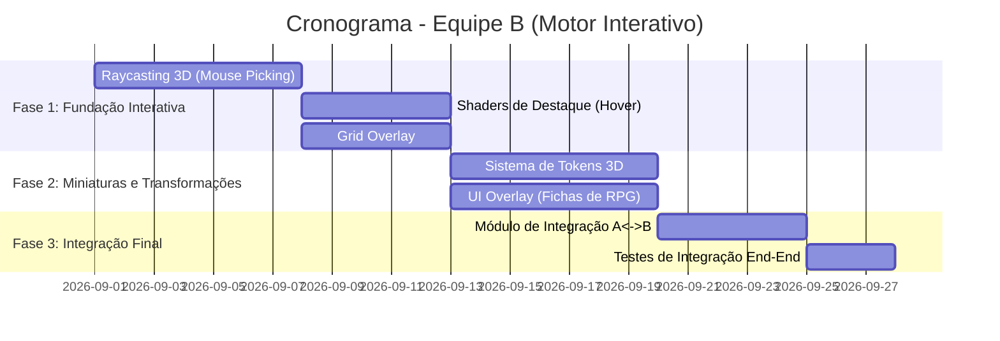

# 🟦 Documento de Arquitetura do Motor Interativo (Equipe B)

[](https://github.com/Ak4ai/Isometricon/milestone/5)
[](https://github.com/Ak4ai/Isometricon/milestone/6)
[](https://github.com/Ak4ai/Isometricon/milestone/7)

## 1. Visão Geral do Subprojeto

O **Motor Interativo (Interactive Engine)** é o subprojeto da **Equipe B** responsável pela camada de interação do usuário no *Isometricon*. Enquanto a Equipe A gera e renderiza o mundo de blocos, a Equipe B processa cliques de mouse, gerencia tokens/miniaturas de personagens e exibe a interface de RPG.

```
+-------------------------------------------------------------+
|                      Isometricon Core                       |
+-------------------------------------------------------------+
                               |
       +-----------------------+-----------------------+
       |                                               |
       v                                               v
+-----------------------------+       +-------------------------------+
|  Equipe A: Motor do Mundo   |       |  Equipe B: Motor Interativo   |
| - Geração Procedural (Noise)|       | - Raycasting 3D (Mouse Pick)  |
| - Chunk Data & Voxel Grid   | <===> | - Grid Overlay & Miniaturas   |
| - Face & Frustum Culling    |       | - UI & Destaques (Hover/Sel.) |
| - Instancing & GLSL Shaders |       | - Controle de Turnos / Fichas |
+-----------------------------+       +-------------------------------+
         |                                       |
         +----------- src/integration/ ----------+
                  VoxelGridProvider / Bridge
```

---

## 2. Estrutura de Pastas da Equipe B

```
src/
├── interaction/               # 🟦 EQUIPE B - Motor Interativo
│   ├── __init__.py
│   ├── raycasting.py          # Mouse Picking: 2D → Raio 3D
│   ├── grid_overlay.py        # Renderização do grid quadriculado
│   ├── token_manager.py       # Gerenciamento de miniaturas/tokens
│   └── ui_renderer.py         # Overlay de UI (fichas de RPG)
├── integration/               # 🔌 Ponte Equipe A <-> Equipe B
│   ├── __init__.py
│   ├── voxel_provider.py      # VoxelGridProvider (implementação)
│   ├── highlight_bridge.py    # HighlightBridge (ativa hover shader)
│   └── camera_provider.py     # CameraStateProvider (matrizes)
assets/
├── shaders/
│   ├── highlight.vert         # 🟦 Shader de destaque/hover (vertex)
│   ├── highlight.frag         # 🟦 Shader de destaque/hover (fragment)
│   ├── grid.vert              # 🟦 Shader de grid overlay (vertex)
│   └── grid.frag              # 🟦 Shader de grid overlay (fragment)
│   ├── ui.vert                # 🟦 Shader 2D ortográfico de UI (vertex)
│   └── ui.frag                # 🟦 Shader de UI com alpha blend (fragment)
tests/
└── test_interaction.py        # 🟦 Testes da Equipe B
```

---

## 3. Pipeline de Renderização da Equipe B

A Equipe B executa seu pipeline **após** o pipeline da Equipe A no mesmo loop de frame:

```
[ Frame começa ]
        │
        ▼
[ Equipe A: Renderiza terreno e blocos ]
        │
        ▼
[ Equipe B: Mouse Picking - Raycasting do cursor ]
        │
        ▼
[ Equipe B: Grid Overlay - Desenha linhas GL_LINES ]
        │
        ▼
[ Equipe B: Tokens - Desenha miniaturas sobre blocos ]
        │
        ▼
[ Equipe B: Highlight Shader - Bloco em hover/selecionado ]
        │
        ▼
[ Equipe B: UI Overlay - Painel de fichas de RPG ]
        │
        ▼
[ swap_buffers() → Apresenta frame ]
```

---

## 4. Módulo 1: Raycasting 3D (Mouse Picking)

### 4.1. Conceito

O **Mouse Picking** resolve o problema de selecionar objetos 3D clicando com o mouse em uma tela 2D. No contexto da projeção ortográfica isométrica da câmera, o algoritmo é:

### 4.2. Unprojection ortográfica

As coordenadas do cursor GLFW começam no topo esquerdo, enquanto NDC usa o
centro e cresce para cima:

$$x_{NDC}=\frac{2x_{mouse}}{W}-1,\qquad
y_{NDC}=1-\frac{2y_{mouse}}{H}$$

O renderer aplica matrizes a vetores-coluna na ordem
$\mathbf{P}\mathbf{V}\mathbf{M}$. A matriz $\mathbf{M}$ é a rotação animada do
tabuleiro usada durante Q/E. Definindo $\mathbf{Q}=\mathbf{P}\mathbf{V}\mathbf{M}$:

$$\mathbf{p}_{near}=\operatorname{dehom}\!\left(
\mathbf{Q}^{-1}(x_{NDC},y_{NDC},-1,1)^T\right)$$

$$\mathbf{p}_{far}=\operatorname{dehom}\!\left(
\mathbf{Q}^{-1}(x_{NDC},y_{NDC},1,1)^T\right)$$

$$\mathbf{o}=\mathbf{p}_{near},\qquad
\mathbf{d}=\frac{\mathbf{p}_{far}-\mathbf{p}_{near}}
{\lVert\mathbf{p}_{far}-\mathbf{p}_{near}\rVert}$$

Em projeção ortográfica, pixels diferentes geram origens diferentes no plano
near e direções paralelas. Incluir $\mathbf{M}$ na inversa devolve o raio no
espaço lógico da grade; assim as coordenadas globais continuam corretas durante
toda a animação de rotação. Pan, zoom e resize entram pelas matrizes e dimensões
recalculadas no frame. Em telas HiDPI, o cursor é convertido para pixels do
framebuffer antes da transformação.

### 4.3. Percurso de voxels com 3D DDA

O voxel inicial é $\lfloor\mathbf{o}\rfloor$, usando `floor` em cada eixo para
preservar coordenadas negativas. Para cada eixo $i$:

$$s_i=\operatorname{sign}(d_i),\qquad
\Delta t_i=\left|\frac{1}{d_i}\right|$$

$t_{max,i}$ guarda a distância até a próxima fronteira da célula. O algoritmo
avança pelo eixo de menor $t_{max}$, soma $\Delta t_i$ e consulta apenas a nova
célula por `VoxelGridProvider.get_block_at()`. Se $d_i=0$, ambos os valores são
$+\infty$ naquele eixo, evitando divisão por zero. Empates usam ordem X, Y, Z
para tornar hits em arestas e cantos determinísticos.

O primeiro bloco diferente de `AIR` vence; `WATER` e `LEAVES` são atingíveis,
mesmo sendo transparentes para o mesher. Chunks não carregados retornam `AIR` e
o raycast não força streaming. O alcance padrão é 256 unidades. Ao entrar numa
célula avançando por $+i$, a normal da face é $-s_i$ naquele eixo. Se a origem
já estiver dentro de um bloco atingível, a distância é zero e a normal é
`(0, 0, 0)`, pois não existe uma única face de entrada.

### 4.4. Interseção Ray-AABB auxiliar

O slab method permanece disponível para picking futuro de tokens, sem ser usado
para varrer todos os voxels:

$$t_{enter}=\max_i\left(\min\left(\frac{B_{min,i}-O_i}{d_i},
\frac{B_{max,i}-O_i}{d_i}\right)\right)$$

$$t_{exit}=\min_i\left(\max\left(\frac{B_{min,i}-O_i}{d_i},
\frac{B_{max,i}-O_i}{d_i}\right)\right)$$

Há hit quando $t_{enter}\le t_{exit}$, $t_{exit}\ge0$ e a interseção respeita
o alcance máximo.

---

## 5. Módulo 2: Shaders de Destaque (Hover & Seleção)

### 5.1. `highlight.vert`

```glsl
#version 330 core

layout(location = 0) in vec3 aPos;

uniform mat4 u_Model;
uniform mat4 u_View;
uniform mat4 u_Projection;

void main() {
    gl_Position = u_Projection * u_View * u_Model * vec4(aPos, 1.0);
}
```

### 5.2. `highlight.frag`

```glsl
#version 330 core

out vec4 FragColor;

uniform vec4  u_HighlightColor; // ex: vec4(1.0, 0.8, 0.0, 0.5) para hover amarelo
uniform float u_Pulse;          // valor de sin(time) passado pelo loop principal

void main() {
    // Efeito pulsante: intensidade varia entre 60% e 100%
    float intensity = 0.6 + 0.4 * u_Pulse;
    FragColor = vec4(u_HighlightColor.rgb, u_HighlightColor.a * intensity);
}
```

**Blending necessário antes do draw call:**
```python
gl.glEnable(gl.GL_BLEND)
gl.glBlendFunc(gl.GL_SRC_ALPHA, gl.GL_ONE_MINUS_SRC_ALPHA)
# ... draw highlight ...
gl.glDisable(gl.GL_BLEND)
```

---

## 6. Módulo 3: Grid Overlay

### 6.1. Geração da Malha do Grid

```python
def build_grid_mesh(width: int, depth: int, y_offset: float = 0.01) -> np.ndarray:
    """
    Gera os vértices das linhas do grid para um terreno de (width x depth) blocos.
    Retorna array de float32 com pares de pontos (GL_LINES).
    """
    lines = []
    for x in range(width + 1):
        lines += [x, y_offset, 0,   x, y_offset, depth]   # linhas em Z
    for z in range(depth + 1):
        lines += [0, y_offset, z,   width, y_offset, z]   # linhas em X
    return np.array(lines, dtype=np.float32)
```

### 6.2. Renderização

```python
# No loop:
gl.glLineWidth(1.0)
grid_shader.set_vec4("u_GridColor", (0.2, 0.2, 0.2, 0.6))
gl.glDrawArrays(gl.GL_LINES, 0, grid_vertex_count)
```

---

## 7. Módulo 4: Sistema de Tokens/Miniaturas

### 7.1. Estrutura de Dados

```python
@dataclass
class Token:
    name: str               # Nome do personagem/monstro
    position: vec3          # Posição atual no grid (inteiros)
    target_pos: vec3        # Posição alvo para lerp de movimento
    mesh: TexturedMesh      # Malha 3D do token (cilindro ou sprite)
    texture_id: int         # Textura da miniatura
    hp: int                 # Pontos de vida
    max_hp: int
    movement_remaining: int # Quadrados de movimento restantes no turno
```

### 7.2. Matriz de Modelo por Token

```python
def get_model_matrix(token: Token, lerp_t: float) -> mat4:
    pos = lerp(token.position, token.target_pos, lerp_t)
    # Centralizar no bloco
    world_pos = vec3(pos.x + 0.5, pos.y + 1.0, pos.z + 0.5)

    T = mat4_translate(world_pos)
    R = mat4_rotate_y(token.yaw)
    S = mat4_scale(vec3(0.8, 0.8, 0.8))

    return T @ R @ S  # MVP aplicado no vertex shader
```

---

## 8. Módulo 5: UI Overlay em OpenGL

### 8.1. Estratégia de Renderização

A UI é renderizada em um **viewport 2D ortográfico** sobreposto à cena 3D:

```python
# Salvar estado
gl.glDisable(gl.GL_DEPTH_TEST)

# Projeção ortográfica 2D para UI
proj_2d = mat4_ortho(0, window_width, 0, window_height, -1, 1)
ui_shader.set_mat4("u_Projection", proj_2d)

# Renderizar painéis (quads texturizados com texto)
render_status_panel(selected_token)

# Restaurar estado
gl.glEnable(gl.GL_DEPTH_TEST)
```

---

## 9. Contratos com a Equipe A

Consulte o documento completo em [docs/INTEGRATION_SPEC.md](INTEGRATION_SPEC.md).

### Resumo das interfaces:

| Interface | Provedor | Consumidor | Finalidade |
|-----------|----------|------------|------------|
| `VoxelGridProvider` | Equipe A | Equipe B | Consulta blocos e colisão |
| `HighlightBridge` | Equipe A | Equipe B | Ativa hover shader |
| `CameraStateProvider` | Equipe A | Equipe B | Matrizes View/Proj para raycasting |

---

## 10. Roadmap da Equipe B



---

## 11. Issues Relacionadas

| Issue | Módulo | Milestone |
|-------|--------|-----------|
| [#27](https://github.com/Ak4ai/Isometricon/issues/27) | Raycasting 3D | Fase 1 |
| [#28](https://github.com/Ak4ai/Isometricon/issues/28) | Shaders de Destaque | Fase 1 |
| [#29](https://github.com/Ak4ai/Isometricon/issues/29) | Grid Overlay | Fase 1 |
| [#30](https://github.com/Ak4ai/Isometricon/issues/30) | Sistema de Tokens | Fase 2 |
| [#31](https://github.com/Ak4ai/Isometricon/issues/31) | UI Overlay (Fichas RPG) | Fase 2 |
| [#33](https://github.com/Ak4ai/Isometricon/issues/33) | Módulo de Integração | Fase 3 |
| [#9](https://github.com/Ak4ai/Isometricon/issues/9) | Contrato A↔B | — |
